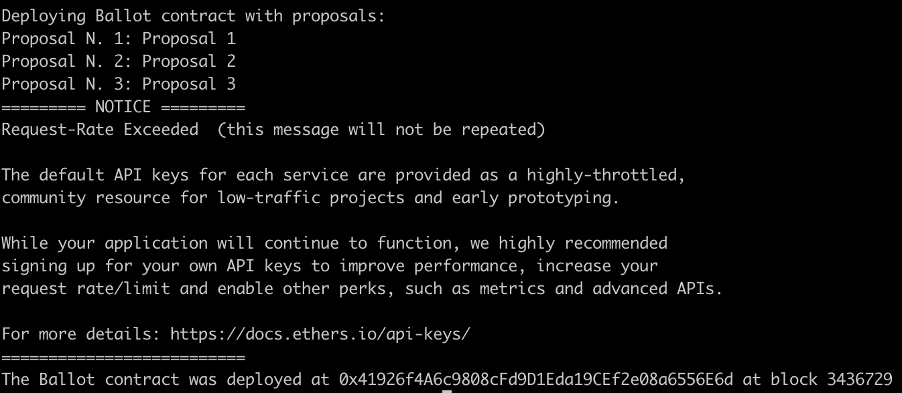
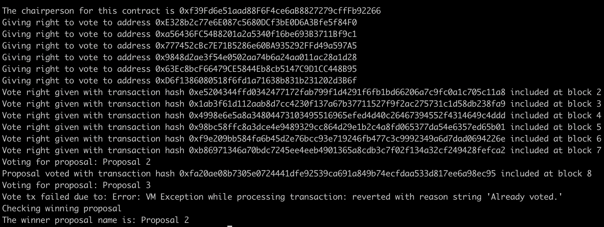
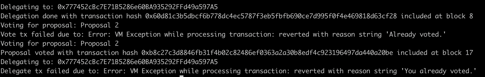

# Ballot Project Week 2

Live on sepolia: https://sepolia.etherscan.io/address/0xa8C5aa27886Cb6A26c3F5Cd6D5Aa1D4F2CF6DaBB#writeContract


# REPORT

The team has prepared a set of /scripts that interacts with the Ballot.sol contract as follows:

## 01-ballot-deploy.ts
This scripts deploys on the Sepolia Testnet the Ballot smart contract using a list or proposals received as process arguments or using the default ones, from which it's a pre-requirement to configure the .env file with the environment variable:
```
PRIVATE_KEY="<your private key here if you don't have a mnemonic seed>"
```



## 03-ballot-vote.ts

This script starts by deploying on the VMB the Ballot contract using a list or proposals received as process arguments or using the default ones. Then we has proven two scenarios: voting and try a second voting transaction that fails by already voted error, then checking the winner proposal.



## 04-ballot-delegate.ts
This scripts starts as same before but in this case, the scenarios were: voting after being delegated delegate after already vote, both fails as seen in screenshots:


